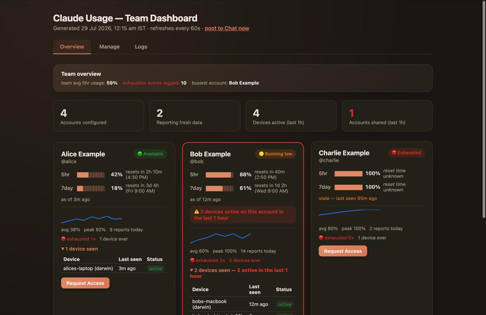
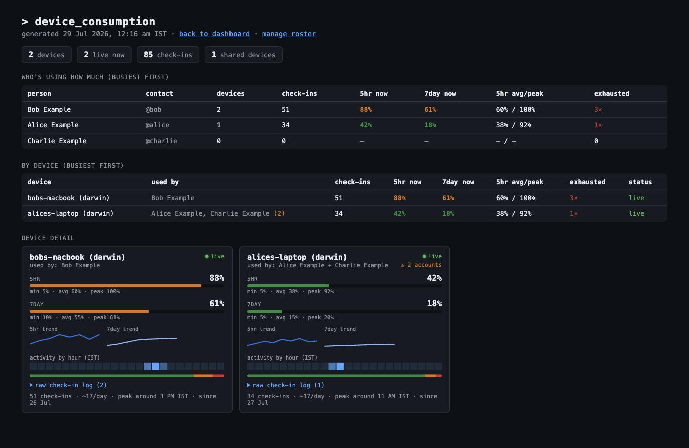
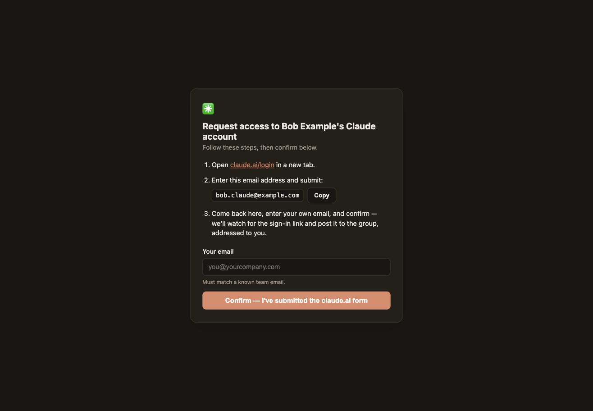

# claude-usage-bot

**Self-hosted Google Chat + web dashboard for tracking shared Claude Pro/Max usage across a team — plus a safe, auditable relay for requesting access to a teammate's account when your own runs dry.**

If your team shares a handful of Claude Pro/Max seats, this answers the questions that come up every day: *who's using how much, right now? whose limit is about to reset? can I borrow spare capacity from someone else's account without just asking for their password in a DM?*

<p align="center">
  
</p>

> All data in every screenshot in this README is synthetic/mock — no real accounts, emails, or company data. See [Data & privacy](#data--privacy).

---

## Why this exists

Anthropic's Claude Pro/Max plans have per-account 5-hour and 7-day usage limits. A small team sharing a few seats hits two recurring problems:

1. **No visibility.** Nobody knows an account is about to hit its limit until someone's mid-task and gets rate-limited.
2. **No safe way to share.** "Can I use your login for an hour?" over chat means passing around real credentials, with zero audit trail.

`claude-usage-bot` solves both without touching anyone's password: a lightweight local hook reports *only* usage percentages (never the OAuth token) to a self-hosted dashboard, and a request-access flow lets teammates borrow spare capacity with a transparent, logged trail in Google Chat — the token itself is never shared, forwarded, or stored by this service.

## Features

- 📊 **Live usage dashboard** — 5-hour and 7-day usage per account, with reset countdowns, sparklines, and trend history, refreshed automatically.
- 💬 **Google Chat integration** — an hourly usage summary posted to your team's space, plus an on-demand trigger.
- 🔁 **Request-access relay** — a teammate can request temporary use of another account; the request and the eventual sign-in link are both posted to the group for full transparency (no DMs, no shared passwords).
- 🖥️ **Multi-device awareness** — flags when one shared account is being used from more than one device at the same time.
- 🔒 **Two independent access gates** — an admin passkey for sensitive views (device breakdown, roster management, account removal) and a separate lower-stakes shared password for the general dashboard.
- 🪝 **One-line install** — a generated Claude Code `Stop` hook that self-reports usage locally; works on macOS, Linux, and Windows (via Git Bash/WSL).
- 🧩 **Zero database** — plain gitignored JSON files for all local state. Runs comfortably on the smallest cloud VM you have.

<p align="center">
  
  
</p>

## How it works

```
┌─────────────────┐        Stop hook (local)          ┌──────────────────────┐
│  Claude Code on  │ ── reads usage % from Anthropic ──▶│  claude-usage-bot     │
│  each teammate's │    (never sends the OAuth token)   │  (Node/Express,       │
│  own machine     │                                     │   self-hosted)       │
└─────────────────┘                                     └──────────┬───────────┘
                                                                     │
                                          ┌───────────────────────────┼───────────────────────────┐
                                          ▼                           ▼                           ▼
                                 Web dashboard               Google Chat space            Request-access relay
                              (usage, trends, admin)      (hourly + on-demand post)      (transparent, logged)
```

Each teammate installs a small script (`curl | bash`) that Claude Code runs automatically on every response. It reads the OAuth token **only locally** to call Anthropic's own usage endpoint, then sends just the resulting percentages — never the token itself — to your self-hosted instance.

---

## 🤖 Set this up with Claude

This repo is written to be handed directly to an AI coding agent — clone it, point Claude Code at the folder, and paste the prompt below. It has everything needed to configure, test, and deploy without you writing a line of code:

> I've cloned claude-usage-bot from GitHub and want it running for my team. Read the README fully, then:
> 1. Run `npm install` and `npm test` to confirm the baseline is green.
> 2. Walk me through creating `.env` from `.env.example` — ask me for each real value one at a time (Google Chat webhook URL, Google OAuth client ID/secret, an admin passkey, a team dashboard password) rather than guessing.
> 3. Help me fill in `src/config/accounts.json` and `src/config/knownRequesters.json` from their `.example.json` templates with my actual team's accounts and roster.
> 4. Start the server locally (`npm start`) and confirm `/claude-usage-bot/health` and `/claude-usage-bot/dashboard` both respond.
> 5. If I want it deployed to a real server, ask me for SSH access and help me set it up as a systemd service (or your platform's equivalent) with the memory/CPU caps described in the README, reverse-proxied behind whatever web server I'm already running.
> 6. Once it's live, help me post the onboarding message (see `src/services/onboardingMessageBuilder.js`) to my team's Google Chat space so everyone knows how to install the reporting hook.

Claude Code (or any capable coding agent) can run this end to end — the codebase is intentionally small, fully unit-tested, and every module is self-documenting via comments explaining *why*, not just *what*.

---

## Quick start (manual)

```bash
git clone https://github.com/ggaryaman12/claude-team-usage-tracker.git
cd claude-team-usage-tracker
npm install
cp .env.example .env        # fill in your values — see table below
cp src/config/accounts.example.json src/config/accounts.json
cp src/config/knownRequesters.example.json src/config/knownRequesters.json
npm start
```

Then open `http://localhost:8090/claude-usage-bot/dashboard`.

### Required setup

| What | Where | Notes |
|---|---|---|
| Google Chat webhook | `.env` → `GOOGLE_CHAT_WEBHOOK_URL` | Space settings → Apps & integrations → Manage webhooks |
| Google OAuth client | `.env` → `GOOGLE_OAUTH_CLIENT_ID` / `_SECRET` | For the Gmail-relay sign-in flow (Cloud Console → Credentials) |
| Team accounts | `src/config/accounts.json` | `[{ "name", "contact", "loginEmail" }]` — the Claude accounts you're tracking |
| Request roster | `src/config/knownRequesters.json` | `[{ "name", "email" }]` — who's allowed to submit an access request |
| Admin passkey | `.env` → `ADMIN_PASSKEY` | Gates `/admin/*` (device breakdown, roster, account removal) |
| Dashboard password | `.env` → `TEAM_PASSWORD` | Shared team password gating `/dashboard` |

Full variable reference: [`.env.example`](.env.example).

### Installing the usage-reporting hook (per teammate)

Each person on the team runs this once, on any OS:

```bash
curl -sL "http://your-deployed-url/claude-usage-bot/install-hook.sh" | bash
```

This registers a Claude Code `Stop` hook. From then on, usage reports itself automatically after every response — no further action needed. Safe to re-run anytime (idempotent, self-upgrading).

## Data & privacy

- **The Claude OAuth token never leaves the teammate's own machine.** The hook reads it locally only to call Anthropic's own API directly; only the resulting percentages are sent to your server.
- **No real user data ships with this repo.** `accounts.json`, `knownRequesters.json`, and all runtime state files are gitignored; only `.example.json` placeholders are committed.
- **All screenshots in this README use synthetic data** generated directly from the page-rendering code with fake names/emails — nothing here is a real deployment.
- Everything runs on infrastructure you control. No third-party analytics, no telemetry.

## Tech stack

Node.js · Express · vanilla server-rendered HTML/CSS/JS (no frontend framework, no build step) · plain JSON files for storage (no database) · Google Chat webhooks · Google OAuth (Gmail relay) · Jest for testing.

## For AI agents / LLM assistants reading this repo

This is a single-process Node/Express app — `src/server.js` is the entrypoint and full route table. There is no database: all persistence is plain JSON files under `src/config/`, each with a small store module (`*Store.js`) exposing `load*`/`save*`/`add*`/`remove*` functions, unit-tested with `fs` mocked via Jest. HTML pages are generated by `*PageBuilder.js` / `*CardBuilder.js` modules returning template-literal strings — no React/Vue/templating engine. Business logic and HTTP wiring are deliberately separated: `server.js` only does routing/glue, every non-trivial computation lives in a `src/services/*.js` module with a matching `*.test.js` testing it in isolation via dependency injection (no real network/filesystem calls in tests). To add a feature, find the closest existing `*Builder.js` or `*Store.js` as the pattern to follow, write a test file in the same style, then wire it into `server.js`.

## Project highlights

A few things about how this was built, for anyone evaluating the engineering behind it:

- Designed and shipped a self-hosted usage-monitoring platform (Node.js/Express, zero database) that replaces manual credential-sharing across a team with a transparent, auditable access-request relay — the OAuth token never leaves the requester's machine or touches the server at any point in the flow.
- Built a real-time analytics layer from scratch — rolling usage history, per-device and per-person trend aggregation, sparkline/heatmap visualizations, and multi-device concurrency detection — entirely with server-rendered HTML/CSS/JS and no frontend framework or build step.
- Enforced a strict dependency-injection + unit-test discipline across ~40 service modules (~300 tests, all filesystem/network calls mocked), keeping HTTP routing and business logic fully decoupled so every non-trivial computation is independently testable.

## Contributing

Issues and PRs welcome. Please include tests for any behavioral change (`npm test`) — this repo has ~300 tests covering every service module and expects that bar to hold.

## License

MIT — see [LICENSE](LICENSE).

---

<sub>Keywords: Claude usage tracker, Claude Pro dashboard, Claude Code Stop hook, Anthropic rate limit monitor, shared Claude account manager, Google Chat bot, team AI usage dashboard, self-hosted Claude monitoring, Claude Max usage tracking, build with Claude.</sub>
